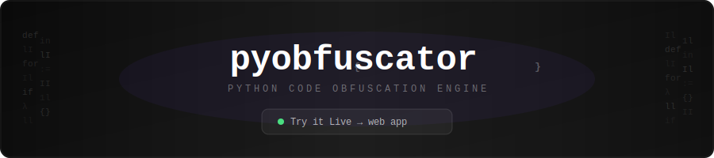

<div align="center">

<a href="https://buglivesmatter.github.io/Best-Python-Obfuscator-NGL/">
  
</a>

<br/>
<br/>

[](https://buglivesmatter.github.io/Best-Python-Obfuscator-NGL/)
[](https://github.com/BugLivesMatter/Best-Python-Obfuscator-NGL/stargazers)
[](LICENSE)

**A powerful, browser-based Python obfuscation engine with AES encryption, bytecode mode, and Windows exe launcher generation — no installation required.**

</div>

---

## ✦ Features

| Feature | Description |
|---|---|
| **Identifier Renaming** | All variables, functions, and class names are replaced with random Unicode-like sequences |
| **String Encryption** | String literals are encrypted at build time and decrypted at runtime, hiding readable text |
| **Junk Code Injection** | Semantically inert dead code blocks are injected throughout the output to confuse analysis |
| **Minification** | Removes whitespace, comments, and docstrings to reduce code size |
| **Hard Obfuscation** | Aggressive mode: heavier encryption schemes, higher junk density, randomized representations |
| **Bytecode Mode** | Encrypts your code payload; a tiny bootstrap decrypts and `exec()`s it in memory — source never touches disk |
| **AES Encryption** | Encrypts the bytecode payload with AES-256 (CryptoJS); the key lives in the Python bootstrap |
| **Exe Launcher** | Generates a companion Windows C launcher that holds the decryption key and pipes it to Python at runtime |
| **Pyobfus-Like Mode** | I/O/l/1 name mangling, control-flow flattening, anti-debugging traps, docstring stripping |

---

## ⚡ Live Web App

No install, no backend. Runs entirely in your browser:

> **[https://buglivesmatter.github.io/Best-Python-Obfuscator-NGL/](https://buglivesmatter.github.io/Best-Python-Obfuscator-NGL/)**

Paste your code, pick your options, hit **obfuscate**. Download the result instantly.

---

## 🛠 Running Locally

```bash
git clone https://github.com/BugLivesMatter/Best-Python-Obfuscator-NGL.git
cd Best-Python-Obfuscator-NGL
npm install
npm run dev
```

Open [http://localhost:5173](http://localhost:5173).

**Build for production:**
```bash
npm run build   # output in dist/
```

---

## 📖 Settings Guide

### Hard Obfuscation

Activates a more aggressive obfuscation pass across all layers:
- Deeper string encryption with multiple randomized schemes
- Higher density and variety of junk-code blocks
- More confusing identifier name patterns

> Use for maximum resistance to static analysis. May slightly increase startup time.

---

### Bytecode Mode

Instead of shipping plain Python source (even if obfuscated), this mode:
1. Encrypts your entire code payload
2. Wraps it in a minimal Python bootstrap
3. At runtime, the bootstrap decrypts the payload **in memory** and `exec()`s it

The actual source never appears on disk. Combine with **AES Encryption** for strongest protection.

---

### AES Encryption

When Bytecode Mode is active, encrypts the payload with **AES-256** (via CryptoJS) on top of base-64 encoding. The decryption key is embedded in the Python bootstrap.

Disable only if you need a minimal loader without the CryptoJS dependency.

---

### Exe Launcher *(Windows)*

The most secure mode. Automatically enables Bytecode Mode.

**Output:** two files with the **same base name**, different extensions:

```
yourscript.py   ← obfuscated Python (useless without the key)
yourscript.c    ← C source for a Windows launcher that holds the key
```

The Python file cannot be run directly — the launcher decrypts and pipes the key to Python at runtime.

#### Setup: MinGW (GCC for Windows)

1. **Download MinGW:**
   [winlibs-x86_64-posix-seh-gcc-15.2.0-mingw-w64msvcrt-13.0.0-r1.zip](https://github.com/brechtsanders/winlibs_mingw/releases/download/15.2.0posix-13.0.0-msvcrt-r1/winlibs-x86_64-posix-seh-gcc-15.2.0-mingw-w64msvcrt-13.0.0-r1.zip)

2. **Extract** to a permanent location, e.g. `C:\mingw64`

3. **Add to PATH:**
   - Open *Start → "Edit the system environment variables"*
   - *Environment Variables → Path → Edit → New*
   - Enter `C:\mingw64\bin` → OK

4. **Verify** in a new terminal:
   ```bash
   gcc --version
   ```

#### Compile the Launcher

```bash
# With console window (standard apps):
gcc yourscript.c -o yourscript.exe

# Without console window (GUI apps — tkinter, PyQt, etc.):
gcc yourscript.c -o yourscript.exe -mwindows
```

Distribute `yourscript.exe` + `yourscript.py` together. Double-clicking the exe decrypts and runs the script.

---

### Pyobfus-Like Mode

Mimics the style of [pyobfuscate](https://github.com/astrand/pyobfuscate):

- **I/O/l/1 name mangling** — identifiers replaced with confusable Unicode-like sequences
- **Control-flow flattening** — logic restructured into switch-dispatch loops
- **Anti-debugging traps** — detects `sys.settrace` / `sys.gettrace` and aborts
- **Docstring stripping** — removes all docstrings
- **Parameter preservation** — function signatures remain valid

---

### GUI (no console)

Only active when **Exe Launcher** is enabled. When checked, the generated C source uses the `-mwindows` GCC flag, suppressing the console window at runtime. Use for applications with their own GUI (tkinter, PyQt, etc.).

---

## 🏗 Tech Stack

| Layer | Technology |
|---|---|
| UI Framework | React 19 + TypeScript |
| Build Tool | Vite 8 |
| Styling | Tailwind CSS v4 |
| Encryption | CryptoJS (AES-256) |
| Icons | Lucide React |
| Deployment | GitHub Pages (GitHub Actions) |

The entire obfuscation engine runs **client-side** in `src/obfuscator/` — no server, no telemetry, no data leaves your browser.

---

## 📁 Project Structure

```
src/
├── obfuscator/
│   ├── index.ts                 # Entry point, orchestrates the pipeline
│   ├── tokenizer.ts             # Python tokenizer
│   ├── analyzer.ts              # Scope & identifier analysis
│   ├── transformer.ts           # Core AST-level transformations
│   ├── nameGenerator.ts         # Identifier name generation
│   ├── stringEncryptor.ts       # String encryption (multiple schemes + AES)
│   ├── junkGenerator.ts         # Dead-code injection
│   ├── minifier.ts              # Whitespace/comment removal
│   ├── controlFlowFlattener.ts  # Control-flow flattening
│   ├── antiDebugging.ts         # Anti-debug injection
│   ├── bytecodeLoader.ts        # Bytecode mode bootstrap generator
│   ├── winLauncherGenerator.ts  # Windows exe launcher C source generator
│   └── vm.ts                    # VM stub
├── components/
│   ├── Background.tsx           # Matrix rain canvas animation
│   ├── Header.tsx               # Site header
│   ├── CodePanel.tsx            # Code editor panel
│   └── HelpPanel.tsx            # Settings reference panel
└── App.tsx                      # Main app shell
```

---

## 📄 License

MIT — do whatever you want, just don't blame me if your obfuscated code gets reverse-engineered anyway.
